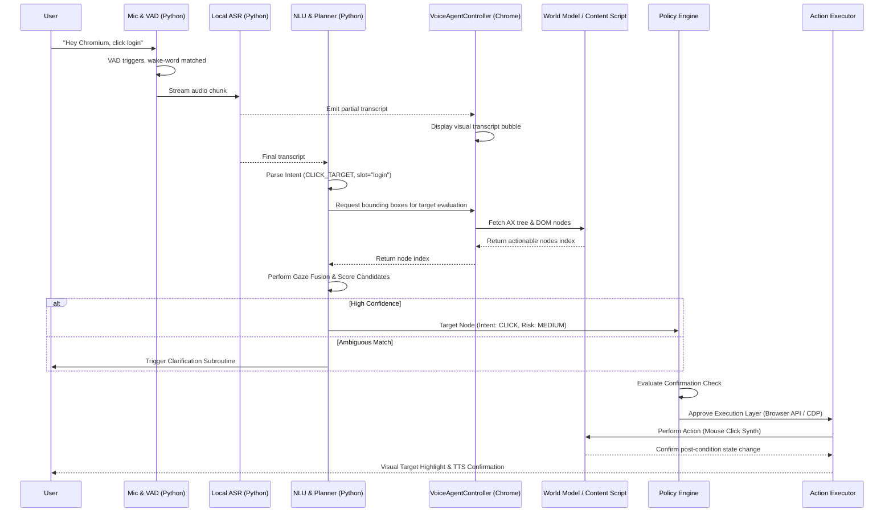

# Chromium Voice + Eye Agent Architecture

## 1. System Overview
The Chromium Voice + Eye Agent is designed as a hybrid extension-backend application that prioritizes 100% local processing, robust hardware acceleration, accessibility-first feedback, and strict privacy guarantees.

The application spans two major components:
- **Chromium Extension (Browser Process):** Operates within the browser's context to intercept commands, handle the policy engine, maintain the world model cache (DOM/Accessibility tree), and execute actions on pages.
- **Python Utility Backend:** A background daemon launched via Native Messaging Host. It handles computationally heavy tasks like streaming ASR (Automatic Speech Recognition), NLU (Natural Language Understanding), wake-word detection, eye-tracking capture and gaze fusion, and Local TTS generation.

## 2. Process Model Diagram

```mermaid
graph TD
    subgraph Browser Process (Chromium Extension)
        VAC[VoiceAgentController]
        WMC[World Model Cache - AX Tree]
        PE[Policy Engine - Risk/Confirm]
        AE[Action Executor]
    end

    subgraph Native Messaging Bridge
        NMH[Native Messaging Host]
    end

    subgraph Utility Process Backend (Python)
        Audio[Audio Pipeline: Mic Capture, VAD, Wake-word, ASR]
        NLU[NLU + Planner: Intent parsing, Grounding]
        Eye[Eye Tracking Pipeline: Gaze Capture, Calibration]
        TTS[Local TTS Synthesis]
    end

    VAC <-->|JSON IPC| NMH
    NMH <-->|JSON IPC| Audio
    NMH <-->|JSON IPC| NLU
    NMH <-->|JSON IPC| Eye
    NMH <-->|JSON IPC| TTS
    
    WMC --> NLU
    NLU --> PE
    PE --> AE
```

## 3. Data Flow & Sequence Diagram

The following sequence illustrates a typical end-to-end command execution flow:



## 4. Hardware Optimization Policy
The architecture dictates strict hardware adherence:
1. **NPU / NEURAL Engine** via CoreML or DirectML (where available).
2. **GPU Execution** via CUDA/Metal backends.
3. **CPU SIMD** execution falls back to AVX2/NEON when accelerators fail.
4. **Thermal Throttling Logic** integrated in the Python scheduler ensures lower-quality quantized models load gracefully if thermal sensors report overheating or latency deadlines are missed.
